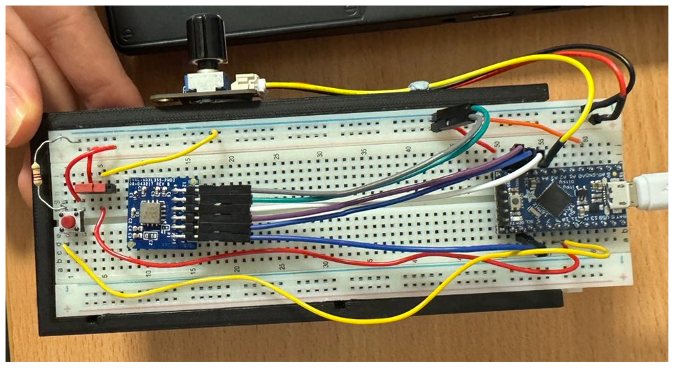
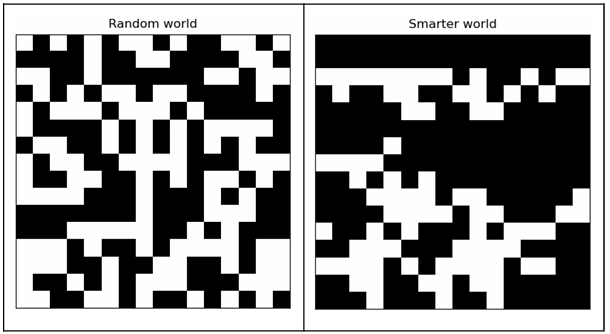
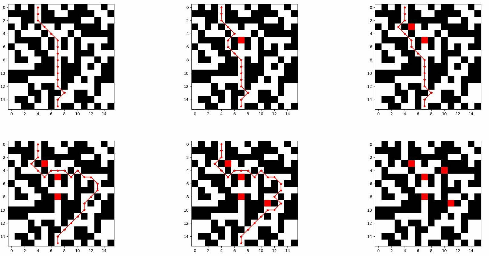

# Cyber-Physical Systems and Control GitHub Repo

Assignments/Labs completed for Cyber-Physical Systems module at Trinity College Dublin

## Advanced Controller (Deliverable 2)

### Concept

Our Advanced Controller idea resembles a controller type formobile games, such as Need for Speed
or Asphalt. Such games have an option to control the car bytilting the phone to desired direction.
Thus, we agreed to implement an accelerometer-basedcontroller for our drone which senses the
angled movement of the controller. 

## Path-generation algorithm (Deliverable 3)

The 16x16 grid generation task was implemented in Python. In the end, two path-generating scripts were written.

## Path-finding algorithm (Deliverable 3)

 As our path-finding algorithm, we have chosen the A* search. This algorithm is said to be one of the
 best and popular path-finding algorithms. It closely resembles the Dijkstra algorithm, but unlike that
 one and manyothers, it involves heuristics.  

 Additionally, we implemented path blocking. See how the path is redirected with every new block.

